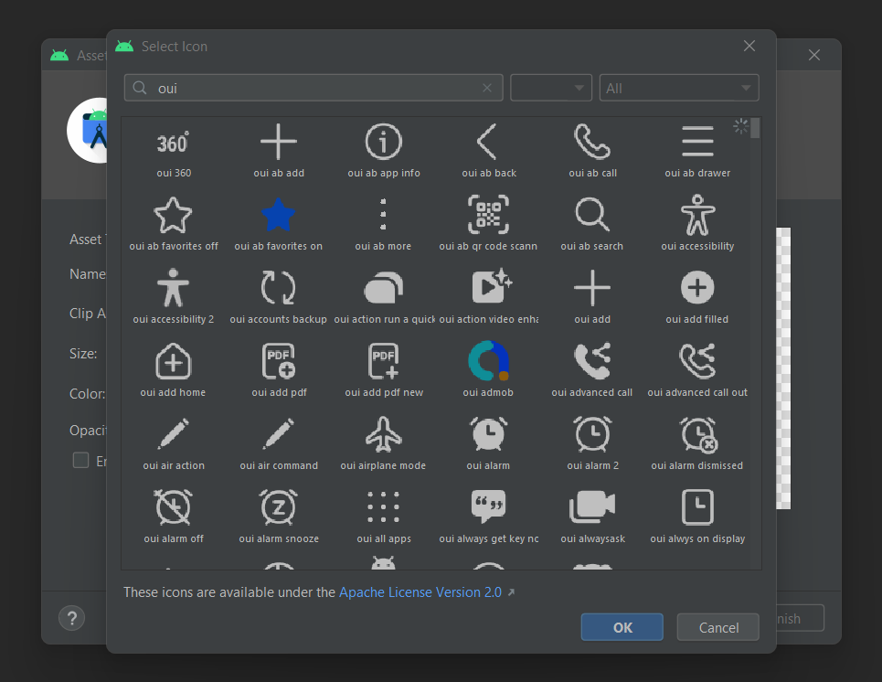

# OneUI Icons

Currently, `957` icons are available (13.07.2022). Special thanks to [Maulana990](https://github.com/Maulana990).

## Android Studio's Asset Studio

  

Pick oneui icons directly from Android Studio's Asset Studio by going to `File > New > Vector Asset > Clip Art` and searching for `oui`.

For this to work, you need to download [material.zip](material.zip) and extract it to `<android_sdk_dir>/icons/material/`. Replace `icons_metadata.txt` and merge the contents of `materialicons`.

Default SDK location:
- Windows: `C:/Users/<username>/AppData/Local/Android/Sdk/`
- MacOS: `/Users/<username>/Library/Android/sdk/`
- Linux: `/home/<username>/Android/Sdk/`

After you've extracted the zip you can open the Asset Studio and find all the oneui icons by searching for `oui`.

**Notes:**
- The Asset Studio will add a tint to the drawable. Simply remove it if you need the colors.
- Some icons might not work, in this case you can also get them from [below](#alternative). (I'm working on a fix)

## Alternative
If you're not using Android Studio or need them as a file you can get them all [here](drawables).